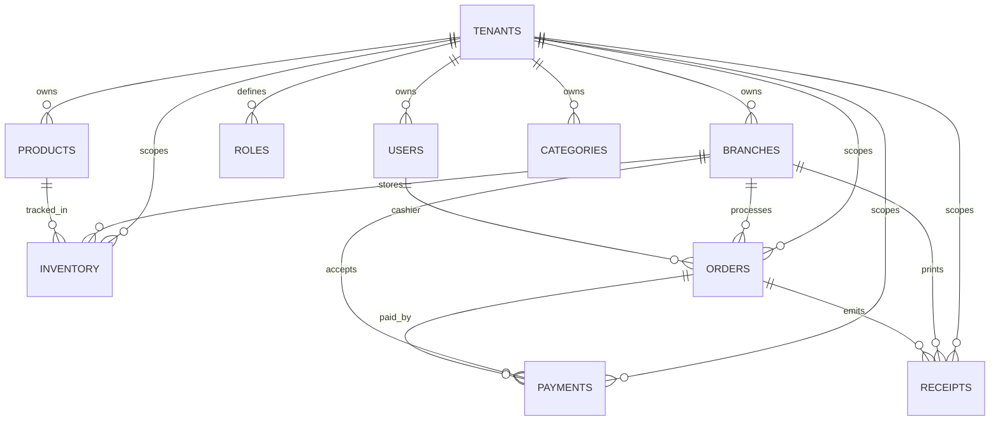

# Cosmic Forge Grocery POS
## Functional Requirements Document (FRD) v1.3 - Phase 2 Foundation Addendum

Version: v1.3  
Status: Draft for Review  
Date: 2026-02-21  
Owner: Application Owner  
Base Reference: `docs/FRD-v1.2.md`

---

## 1. Scope

This addendum captures Phase 2 foundational delivery for:
- Supabase Phase 2 schema migration and seed expansion
- Backend API scaffold (auth/products/orders/reporting modules)
- Mobile scaffold (Flutter, localization baseline, module shell routing)
- CI expansion to execute backend and mobile tests in full-sync gate

Scope rule:
- additive-only changes
- no runtime business logic rewrites for existing phases/modules

---

## 2. Phase 2 Schema (Supabase)

Migration artifact:
- `supabase/migrations/20260221120107_20260221_phase2_core_schema.sql`

Seed artifact:
- `supabase/seed_phase2.sql`

### 2.1 Entity Diagram (Logical)



### 2.2 Security and Isolation Contract

- RLS enabled on tenant-scoped Phase 2 tables.
- Policies enforce `app.tenant_id` scope, and branch-scoped tables also enforce `app.branch_id`.
- Migration and drift verification are enforced through CI gate (`supabase:ci`).

---

## 3. Backend API Scaffold Contract

Implementation root:
- `backend/src/`

Current scaffold endpoints:

| Domain | Method | Path | Input Contract | Output Contract |
|---|---|---|---|---|
| Health | GET | `/health` | none | `{ ok, service, phase }` |
| Auth | POST | `/api/auth/signup` | `{ email }` | `{ userId, email, status }` |
| Auth | POST | `/api/auth/login` | `{ email, password }` | `{ accessToken, refreshToken, user }` |
| Auth | POST | `/api/auth/password-reset` | `{ email }` | `{ email, status }` |
| Products | GET | `/api/products` | none | `{ items[] }` |
| Products | POST | `/api/products` | `{ name, sku }` | `{ item }` |
| Inventory | GET | `/api/products/inventory` | none | `{ items[] }` |
| Inventory | PATCH | `/api/products/inventory` | `{ productId, quantity }` | `{ productId, quantity }` |
| Orders | GET | `/api/orders` | none | `{ items[] }` |
| Orders | GET | `/api/orders/:orderId` | path `orderId` | `{ item }` or `404` |
| Orders | POST | `/api/orders` | `{ total }` | `{ item }` |
| Orders | PATCH | `/api/orders/:orderId` | path `orderId`, optional `{ total }` | `{ item }` |
| Orders | POST | `/api/orders/:orderId/cancel` | path `orderId` | `{ item }` |
| Reporting | GET | `/api/reporting/daily-sales` | none | `{ date, grossSales, receipts, currency }` |
| Reporting | GET | `/api/reporting/low-stock` | none | `{ generatedAt, items[] }` |

---

## 4. Mobile Flow (Flutter)

Implementation root:
- `grocery_pos_mobile/`

Localization baseline:
- English (`assets/langs/en.json`)
- Myanmar (`assets/langs/my.json`)

Screen flow (Phase 2 shell):

```text
Home
  -> Auth (Login -> Signup / Password Reset)
  -> Products (List -> Detail)
  -> Cart (-> Checkout)
  -> Orders (History)
```

Mobile secrets rule:
- mobile client reads `SUPABASE_URL` and `SUPABASE_ANON_KEY` only via compile-time env.
- database URL/password and service-role key remain backend/CI secrets only.

---

## 5. CI / Delivery Enforcement

`full-sync` gate workflow executes:
- lint
- build
- core tests (`test`, `test:e2e`, `test:security`, `test:chaos`, `test:performance`)
- backend tests (`test:backend`, `test:api`)
- mobile tests (`flutter test`)
- migration gate (`supabase:ci`)

`main` deployment workflow executes:
- Supabase production migration gate before staging/prod promotion
- Vercel staging deploy + smoke validation
- production deploy on staging success

---

END OF DOCUMENT
